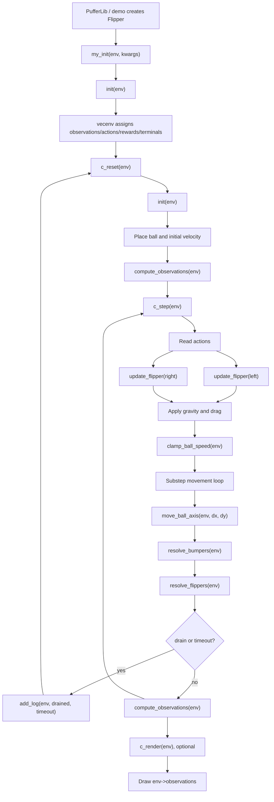

# Flipper Environment Skeleton

This is the first clean, testable version of `flipper`: a small single-agent,
pinball-like environment built in the simple `ocean/my_env` style.

The goal of this skeleton is not realism yet. It is to make the memory layout,
function flow, and first physical rules easy to inspect and adjust.

## Current Model

- The map is a fixed high-detail byte grid: `FLIPPER_PHYS_ROWS x FLIPPER_PHYS_COLS`.
- Static geometry is defined by helper predicates:
  - `is_wall_cell(row, col)`
  - `is_bumper_cell(row, col)`
- The ball is a point mass with:
  - position: `ball_x`, `ball_y`
  - velocity: `ball_vx`, `ball_vy`
  - acceleration: `ball_ax`, `ball_ay`
- The two flipper bars have:
  - `left_phase`, `right_phase` in `[0, 1]`
  - `left_omega`, `right_omega` as phase deltas used for impulse strength
- Observations are rebuilt from canonical state each step:
  - `EMPTY`
  - `BALL`
  - `WALL`
  - `BUMPER`
  - `LEFT_FLIPPER`
  - `RIGHT_FLIPPER`

## Action Semantics

The intended design is:

- 2 continuous actions for bar speed
- 2 binary actions for hold/release

The current binding exposes four continuous heads:

```c
#define NUM_ATNS 4
#define ACT_SIZES {1, 1, 1, 1}
```

This is because the stock PufferLib backend currently supports all-continuous or
all-discrete action spaces, but not mixed spaces. Inside `c_step`, the last two
actions are still treated as binary hold decisions:

```c
int left_hold = env->actions[ACTION_LEFT_HOLD] > 0.0f;
int right_hold = env->actions[ACTION_RIGHT_HOLD] > 0.0f;
```

So the environment semantics already match the intended design, while the
training interface remains compatible with the existing default policy.

## Sequential Function Graph



## Function Roles

`my_init`

Called by the PufferLib binding before buffers are attached. It sets fixed env
parameters such as `num_agents` and `max_ticks`.

`init`

Resets mutable episode bookkeeping: tick counter, episode return, flipper
phases, flipper velocities, and contact cooldowns.

`c_reset`

Required PufferLib reset hook. It calls `init`, places the ball, sets its
initial velocity and acceleration, then writes the initial observation.

`compute_observations`

Clears the byte grid and redraws the world in layers:

1. static walls
2. static bumpers
3. current flipper bars
4. current ball position

This is intentionally redundant and simple. Later, static walls/bumpers can be
cached and copied before dynamic entities are drawn.

`c_step`

Required PufferLib step hook. This is the main physics loop:

1. read actions
2. update flipper phases
3. apply gravity and drag
4. clamp ball speed
5. substep movement
6. resolve wall, bumper, and flipper interactions
7. terminate/reset on drain or timeout
8. otherwise rebuild observations

`move_ball_axis`

Moves the ball as a point mass and reflects velocity when the next x or y cell
is a wall. This is the simplest collision model and should be replaced later by
a richer swept or radius-aware collision model.

`resolve_bumpers`

Checks radial bumper collisions. If the ball is moving into a bumper, velocity
is reflected around the bumper normal, the ball is nudged outside the bumper,
and a small reward/log event is emitted.

`resolve_flippers`

Checks temporary rectangular hit zones near the bottom. If the ball is inside a
zone while a flipper is moving upward, it receives a hard-coded impulse:

- left flipper: up-right
- right flipper: up-left

This is the main placeholder to replace with rotating-segment collision.

`add_log`

Aggregates episode metrics after a terminal event. `perf` is currently survival
fraction, which is useful before the environment has a more meaningful objective.

`c_render`

Draws the current observation grid with raylib. This is intentionally tied to
`env->observations`, so the debug view shows exactly what the policy sees.

## Extension Points

- To change the wall layout, edit `is_wall_cell`.
- To change bumper count or placement, edit `BUMPER_ROWS`, `BUMPER_COLS`, and
  `FLIPPER_NUM_BUMPERS`.
- To make bumper physics richer, edit `resolve_bumpers`.
- To replace the temporary rectangular flipper hit zones, edit:
  - `ball_in_left_flipper_zone`
  - `ball_in_right_flipper_zone`
  - `resolve_flippers`
- To tune base dynamics, start with:
  - `FLIPPER_GRAVITY`
  - `FLIPPER_DRAG`
  - `FLIPPER_MAX_SPEED`
  - `FLIPPER_WALL_RESTITUTION`
  - `FLIPPER_BUMPER_RESTITUTION`
  - `FLIPPER_BASE_KICK`
  - `FLIPPER_OMEGA_KICK`

## Build Checks

Local interactive build:

```bash
scripts/build_macos_cpu.sh flipper --local
```

CPU extension build:

```bash
scripts/build_macos_cpu.sh flipper
```

Tiny smoke test after the CPU extension build:

```python
import numpy as np
import pufferlib._C as C

args = {
    "vec": {"total_agents": 8, "num_buffers": 1},
    "env": {"max_ticks": 1200},
}
vec = C.create_vec(args, 0)
vec.reset()
actions = np.zeros((vec.total_agents, vec.num_atns), dtype=np.float32)
actions[:, 2:] = -1.0
vec.cpu_step(actions.ctypes.data)
vec.close()
```
